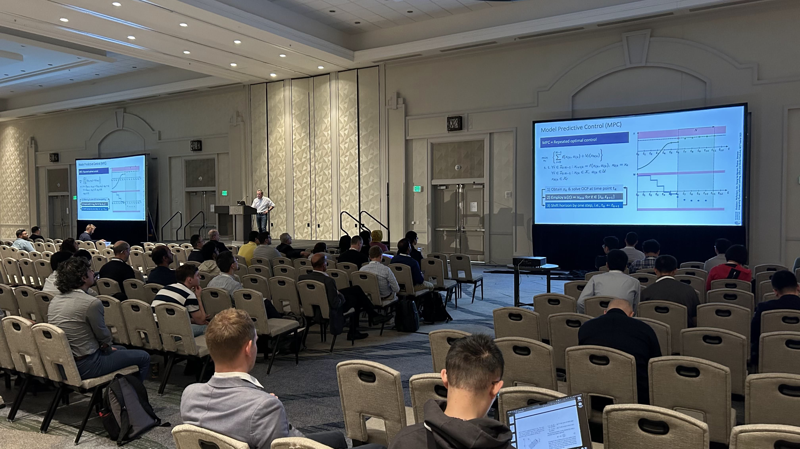
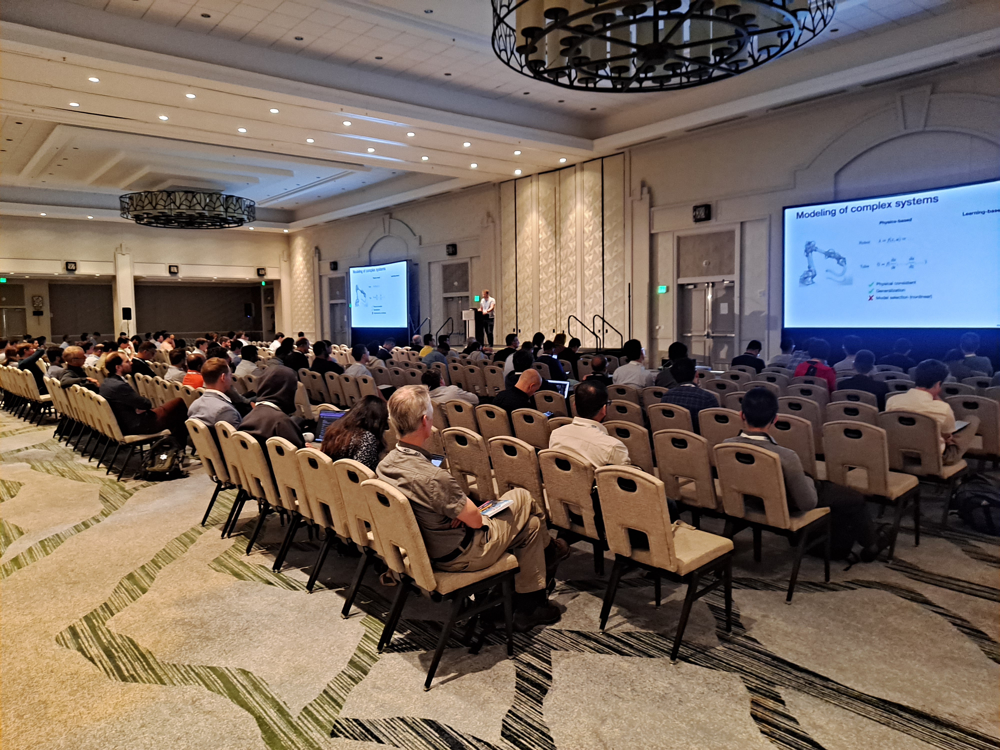
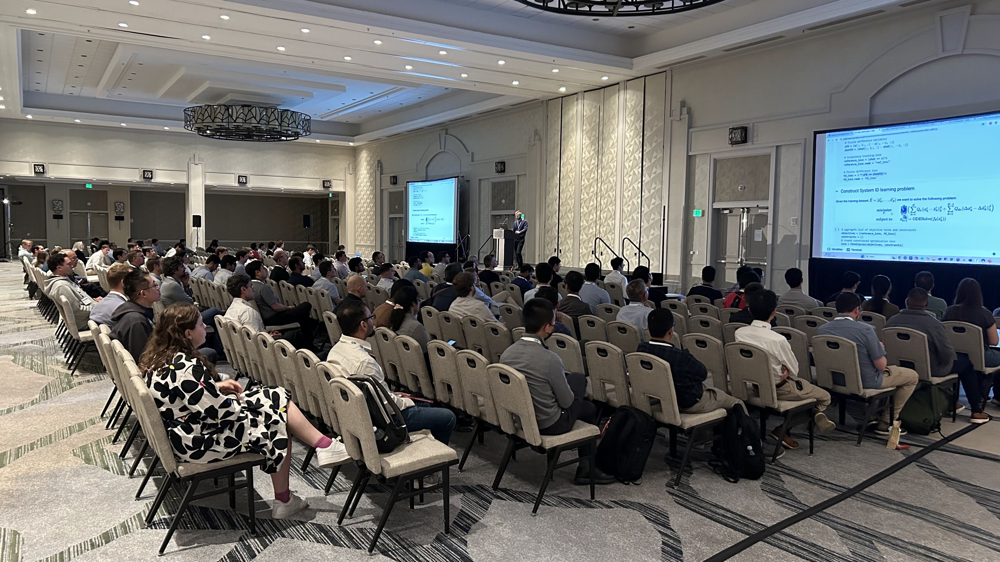

#  ACC 2025 Tutorial Session on Safe Physics-Informed Machine Learning for Dynamics and Control

Material for the tutorial session "Safe Physics-Informed Machine Learning for Dynamics and Control" presented at the American Control Conference (ACC) 2025.


## Tutorial paper
[S-PIML tutorial paper on arxiv](https://arxiv.org/abs/2504.12952)  

## Cite as
```yaml
@misc{drgona2025safephysicsinformedmachinelearning,
      title={Safe Physics-Informed Machine Learning for Dynamics and Control}, 
      author={Jan Drgona and Truong X. Nghiem and Thomas Beckers and Mahyar Fazlyab and Enrique Mallada and Colin Jones and Draguna Vrabie and Steven L. Brunton and Rolf Findeisen},
      year={2025},
      eprint={2504.12952},
      archivePrefix={arXiv},
      primaryClass={eess.SY},
      url={https://arxiv.org/abs/2504.12952}, 
}
```

### Authors of the paper
- <a href="https://drgona.github.io/" target="_blank">Jan Drgona</a> (JHU)
- <a href="https://truong.nxtlab.org/" target="_blank">Truong X. Nghiem</a> (UCF)
- <a href="https://www.tbeckers.com/" target="_blank">Thomas Beckers</a> (Vanderbilt )
- <a href="https://www.ece.jhu.edu/mahyarfazlyab/" target="_blank">Mahyar Fazlyab</a> (JHU)
- <a href="https://mallada.ece.jhu.edu/" target="_blank">Enrique Mallada</a> (JHU)
- <a href="https://people.epfl.ch/colin.jones" target="_blank">Colin Jones</a> (EPFL)
- <a href="https://www.pnnl.gov/people/draguna-vrabie-phd" target="_blank">Draguna Vrabie</a> (PNNL)
- <a href="https://www.eigensteve.com/" target="_blank">Steve Brunton</a> (UW)
- <a href="https://www.etit.tu-darmstadt.de/fachbereich/professuren_etit/etit_prof_details_104640.en.jsp" target="_blank">Rolf Findeisen</a> (TU Darmstadt)


## Session slides
<a href="./slides/Drgona_safePIML_25_min.pdf" target="_blank">Jan Drgona</a>
<a href="./slides/Beckers_Structured_learning_tutorial.pdf" target="_blank">Thomas Beckers</a>  
<a href="./slides/XYZ" target="_blank">Rolf Findeisen</a>  


## Session photos





